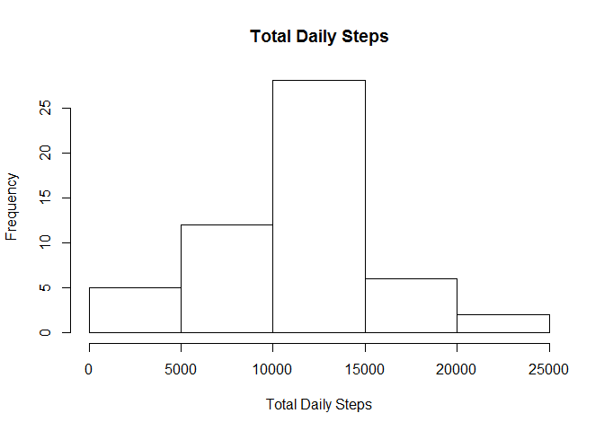
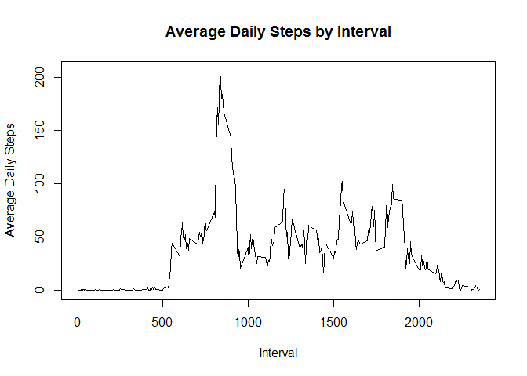
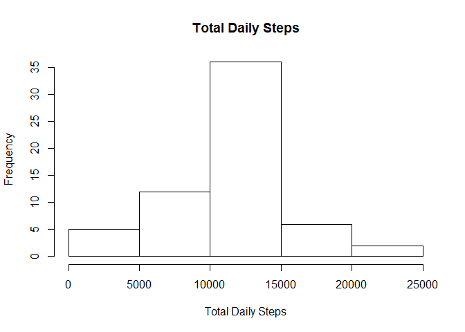
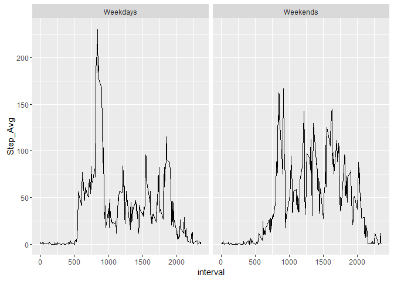

# Reproducible Research Assignment 1
EC  
January 5, 2016  

This is Peer Assessment #1 for Reproducible Research. The packages used for this analysis are:

- dplyr
- lubridate
- Hmisc


```r
library(dplyr)
library(lubridate)
library(Hmisc)
```

## The data is read in and converted to a table data frame:


```r
data <- read.csv("activity.csv", header = TRUE, stringsAsFactors=FALSE)
datatdf <- tbl_df(data)
```

The assignment instructions states that NA values may be ignored for :
- calculating thetotal number of steps per day
- plotting a histogram for the number of steps taken each day
- calculating themean and median of the total number of steps per day

So we delete all rows with NA values and place the remaining data into a clean table.


```r
datatdf_cln <- na.delete(datatdf)
```

To calculate the daily steps, we use dplyr to group by date and then summarise the mean of "steps," and place the results into a new table. 


```r
datatdf_day <- group_by(datatdf_cln, date)
dly_step_total <- summarise(datatdf_day, Total_Steps = sum(steps))
```

## Histogram of Total Daily Steps


```r
hist(dly_step_total$Total_Steps, 
     xlab ="Total Daily Steps",
     main ="Total Daily Steps")
```

 

From this same table, we can calculate daily average and median steps taken:


```r
dly_step_avg <- mean(dly_step_total$Total_Steps)
dly_step_median <- median(dly_step_total$Total_Steps)
```

## Mean and Median Total Daily Steps  
- Mean daily steps is: **1.0766189\times 10^{4}**
- Median daily steps is: **10765**

To gather a daily activity pattern, we group by intervals, take the mean by of steps by interval:


```r
datatdf_int <- group_by(datatdf_cln, interval)
int_step_avg <- summarise(datatdf_int, Avg_Steps=mean(steps))
```

## Plot of average steps vs interval


```r
plot(int_step_avg$interval, int_step_avg$Avg_Steps,
     type="l",
     xlab="Interval",
     ylab="Average Daily Steps",
     main="Average Daily Steps by Interval")
```

 

To obtain the interval with the peak daily step average, we sort the table according to step average, and examine whether there is only one interval that features a maximum value.


```r
sorted_int_step_avg <- arrange(int_step_avg, desc(Avg_Steps))
sorted_int_step_avg
```

```
## Source: local data frame [288 x 2]
## 
##    interval Avg_Steps
##       (int)     (dbl)
## 1       835  206.1698
## 2       840  195.9245
## 3       850  183.3962
## 4       845  179.5660
## 5       830  177.3019
## 6       820  171.1509
## 7       855  167.0189
## 8       815  157.5283
## 9       825  155.3962
## 10      900  143.4528
## ..      ...       ...
```

## Highest daily step average interval
The output above shows that there is only one interval (835) that features a maximum daily step average, which is **206.1698113**.

## The number of NA's in the original data set
can be evaluated with the following expression:


```r
na_num <- sum(!complete.cases(datatdf))
```

There are **2304** rows with NA values in the original data set.

## Strategy for Imputing Data

The approach is to fill in NA values for each interval with the average daily value for that interval. 


```r
# create a T/F vector that determines NA values for steps
      na_rows <- is.na(data$steps)

# create an index vector to map (interval+1) to the vector address 
# (because there are no 0 addresses in R, but there is a 0 interval in the dataset)
      
      # populate index with NA's
      int_map<-rep("NA", each=2356)
      int_map <-as.numeric(int_map)
```

```
## Warning: NAs introduced by coercion
```

```r
      # fill in index with calculated for defined intervals from dataset (w/ +1 shift)
      for(i in 1:length(int_step_avg$interval)){
            int_map[int_step_avg$interval[i]+1] <- int_step_avg$Avg_Steps[i]
      }
      
# define an imputed data frame
      imputed_data <- data
      
# for each row/interval where steps is NA, substitute with the daily average value for that interval
      for(i in 1:length(na_rows)){
            if(na_rows[i]=="TRUE"){
                  imputed_data$steps[i] <- int_map[data$interval[i]+1]
            }
      }
```

To calculate the daily steps with the imputed data, we use dplyr to group by date and then summarise the mean of "steps," and place the results into a new table. 


```r
imputed_datatdf <- tbl_df(imputed_data)
      
imputed_day <- group_by(imputed_datatdf, date)
imp_dly_step_total <- summarise(imputed_day, Total_Steps = sum(steps))
```

## Imputed Histogram of Total Daily Steps


```r
hist(imp_dly_step_total$Total_Steps, 
     xlab ="Total Daily Steps",
     main ="Total Daily Steps")
```

 

From this same table, we can calculate daily average and median steps taken:


```r
imp_dly_step_avg <- mean(imp_dly_step_total$Total_Steps)
imp_dly_step_median <- median(imp_dly_step_total$Total_Steps)
```

## Imputed Mean and Median Total Daily Steps  
- Mean daily steps is: **1.0766189\times 10^{4}**
- Median daily steps is: **1.0766189\times 10^{4}**

**There is a slight but insignificant change with the addition of the imputed data**

Categorizing the data *with imputed data added* using lubridate, and then creating a new table with interval step averages grouped differentiated by weekend and weekday:


```r
# categorize each observation by day of week, using lubridate
      imputed_week <- mutate(imputed_data, weekday=wday(date))

# separate weekday and weekend data into different tables
      imputed_weekend <- subset(imputed_week, weekday==1 | weekday==7)
      imputed_weekday <- subset(imputed_week, weekday==2 | weekday==3 
                                | weekday==4 | weekday==5 | weekday==6)

# group each table by interval using dplyr
      by_end <- group_by(imputed_weekend, interval)
      by_day <- group_by(imputed_weekday, interval)

# summarizing each of the above tables by mean steps using dplyr
      int_by_end <- summarise(by_end, Step_Avg=mean(steps))
      int_by_day <- summarise(by_day, Step_Avg=mean(steps))

# label each summarized interval step average with weekend or weekday, as appropriate
      int_by_end <- mutate(int_by_end, category=rep("Weekends", each=nrow(int_by_end)))
      int_by_day <- mutate(int_by_day, category=rep("Weekdays", each=nrow(int_by_day)))

# combining weekend and weekday tables into one
      int_by_week <- rbind(int_by_end, int_by_day)
```

## Panel Plot of Comparison between Weekday and Weekend Step Averages by Interval


```r
      qplot(interval, Step_Avg, data=int_by_week, facets=.~category, geom="line")
```

 
